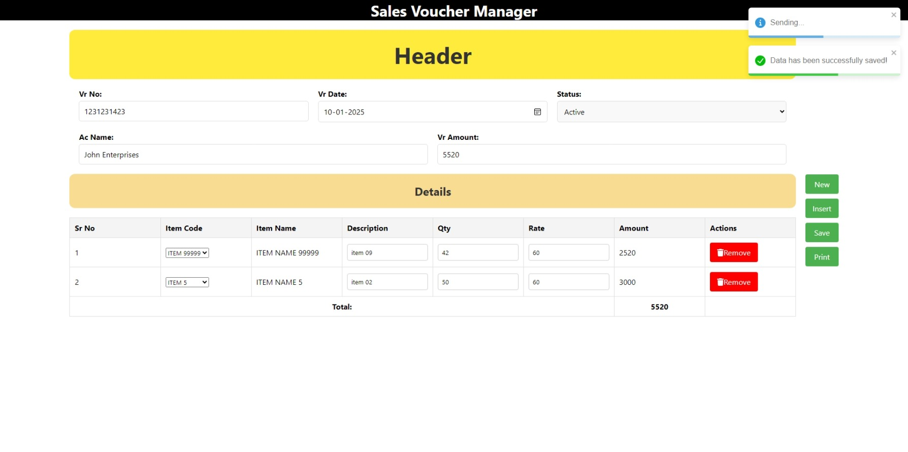
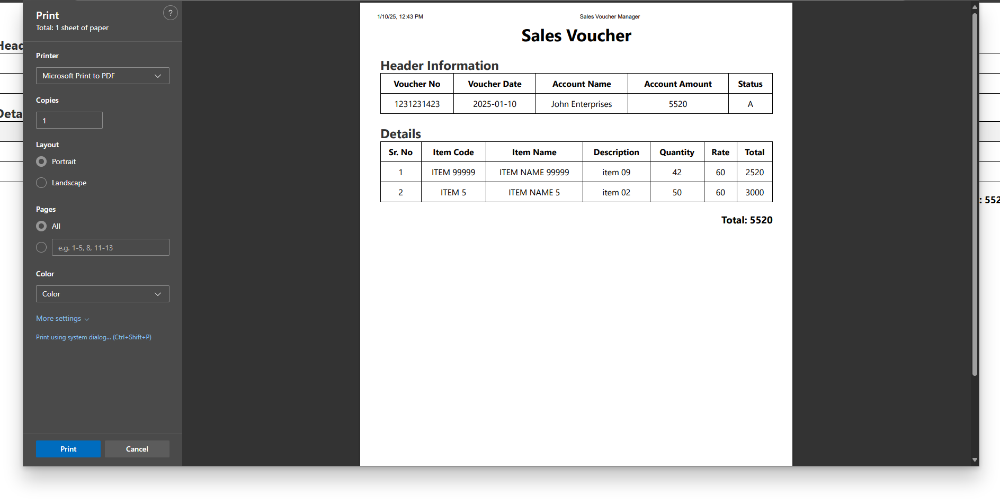

# Sales Voucher Manager

Sales Voucher Manager is a single-page application (SPA) designed to streamline the creation, management, and printing of sales vouchers. This application allows users to input header details, add multiple line items dynamically, validate data, and save the information to a database. Additionally, it provides a printable version of the saved vouchers.

## Features

### 1. Header Section
- Input fields for voucher details such as:
  - Voucher Number
  - Date
  - Account Name
  - Status

### 2. Detail Section
- Dynamic rows to input item details:
  - Item Name
  - Description
  - Quantity
  - Rate
- Add or remove rows as needed.

### 3. Validation
- Ensures that all required fields are filled.
- Checks for correct data formats.

### 4. Save Functionality
- Saves header details to the `header_table`.
- Saves item details to the `detail_table`.
- Displays success or error messages using toasts.

### 5. Print Feature
- Generates a printable version of the saved voucher.
- Clean and professional layout for physical copies.

## Technologies Used

### Frontend
- **React**: For building the user interface.
- **CSS Modules**: For styling.
- **React Redux**: For state management.
- **React Router**: For navigation.
- **React Toastify**: For notifications.
